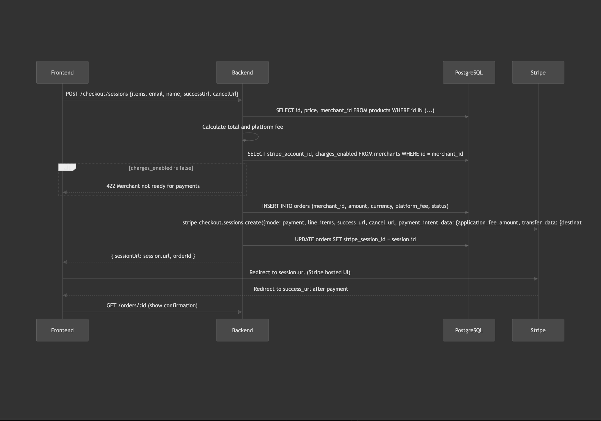

# Afto — Bombay Grocers Platform

This is readme on the components that are built and also how to start the services.

- **`api/`** — Express 5 REST API (TypeScript, PostgreSQL + Elasticsearch)
- **`crawler/`** — Shopify scraper (TypeScript)
- **`ingestion_pipeline/`** — Dagster ETL pipeline (Python)
- **`frontend/`** — Next.js 14 ecommerce frontend (TypeScript, Tailwind, Zustand)

---

## Prerequisites

- Node.js 18+
- Python 3.11+
- PostgreSQL running locally
- Elasticsearch/OpenSearch running locally

---

## API Setup

```bash
cd api
npm install
cp .env.example .env   # set RDS_* and OPENSEARCH_HOST
npm run dev            # starts on http://localhost:3000
```

### API Endpoints

| Method | Path            | Description                                                  |
| ------ | --------------- | ------------------------------------------------------------ |
| GET    | `/`             | Top 20 most recently added products                          |
| GET    | `/products`     | Paginated products (`?category=&page=`)                      |
| GET    | `/products/:id` | Single product detail                                        |
| GET    | `/search`       | Elasticsearch full-text search (`?q=&category=&sort=&page=`) |
| GET    | `/checkout`     | Stub — returns 501                                           |

.env.example:
RDS_HOST=<localhost>
RDS_DB=<your-DB-name>
RDS_USER=<user-name>
RDS_PASSWORD=<your-password>

OPENSEARCH_HOST=<http://localhost:9200>
PORT=<PORT>

STRIPE_SECRET_KEY=<stripe-secret-key>
STRIPE_PUBLISHABLE_KEY=<stripe-publishable-key>
FRONTEND_URL=http://localhost:3001

---

## Frontend Setup

```bash
cd frontend
npm install
cp .env.local.example .env.local   # set NEXT_PUBLIC_API_URL
npm run dev                         # starts on http://localhost:3001
```

### Routes

| Path               | Description                              |
| ------------------ | ---------------------------------------- |
| `/`                | Home — editorial landing, top products   |
| `/category/[slug]` | Category product listing with pagination |
| `/product/[id]`    | Product detail                           |
| `/search`          | Full-text search with autocomplete       |
| `/cart`            | Cart page (Zustand, persisted locally)   |
| `/checkout`        | Checkout form (501 graceful handling)    |
| `/order-success`   | Post-order confirmation                  |

### Frontend Tech Stack

- **Framework:** Next.js 14 (App Router)
- **Language:** TypeScript
- **Styling:** Tailwind CSS with custom design tokens
- **Fonts:** Crimson Pro (serif headings) + Space Grotesk (sans body)
- **Components:** Atomic design — atoms / molecules / organisms / templates
- **State:** Zustand (cart, persisted to localStorage)
- **Tests:** Vitest + Testing Library (71 unit tests, TDD)

### Running Tests

```bash
cd frontend
npm test             # run all unit tests once
npm run test:watch   # watch mode
npm run test:coverage
```

---

## Crawler

```bash
cd crawler
npm install
npm run scrape   # outputs to crawler/output/products_canonical.json
```

---

## Ingestion Pipeline

```bash
pip install -r requirements.txt
cd ingestion_pipeline
dagster dev   # opens Dagster UI at http://localhost:3000 OR
dagster job execute -j ingestion_job

```

Run the `afto_pipeline` job to load data from the crawler output into PostgreSQL and Elasticsearch.

---

## Environment Variables

### `api/.env`

```
RDS_HOST=localhost
RDS_DB=afto-database
RDS_USER=postgres
RDS_PASSWORD=yourpassword
OPENSEARCH_HOST=http://localhost:9200
PORT=3000
```

### `frontend/.env.local`

```
NEXT_PUBLIC_API_URL=http://localhost:3000
```

---

## Schema

Database Schema

# Categories

id (UUID, primary key)

name (unique, required)

created_at (timestamp)

# Subcategories

id (UUID, primary key)

name (required)

category_id (references Categories)

created_at (timestamp)

unique constraint on (name, category_id)

# Merchants

id (UUID, primary key)

name (required)

stripe_account_id (unique)

verification_status (default: pending)

charges_enabled (boolean)

payouts_enabled (boolean)

updates_enabled (boolean)

created_at (timestamp)

# Products

id (text, primary key)

name (required)

description

price (numeric)

currency (required)

availability

images (array of text)

category_id (references Categories)

subcategory_id (references Subcategories, optional)

merchant_id (references Merchants, optional)

created_at (timestamp)

# Orders

id (UUID, primary key)

merchant_id (references Merchants)

amount (numeric)

currency (default: USD)

platform_fee (numeric)

status (pending / paid / failed / cancelled)

stripe_session_id

stripe_payment_intent_id

customer_email

customer_name

created_at (timestamp)

updated_at (timestamp)

# Order Items

id (UUID, primary key)

order_id (references Orders)

product_id (references Products)

quantity (integer)

# Checkout flow for backend-checkout flow


